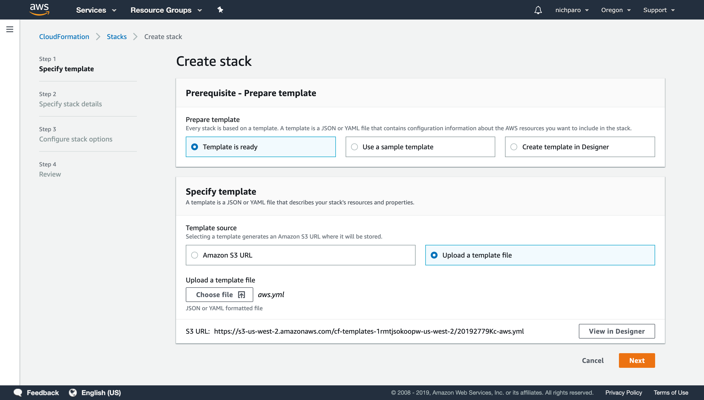
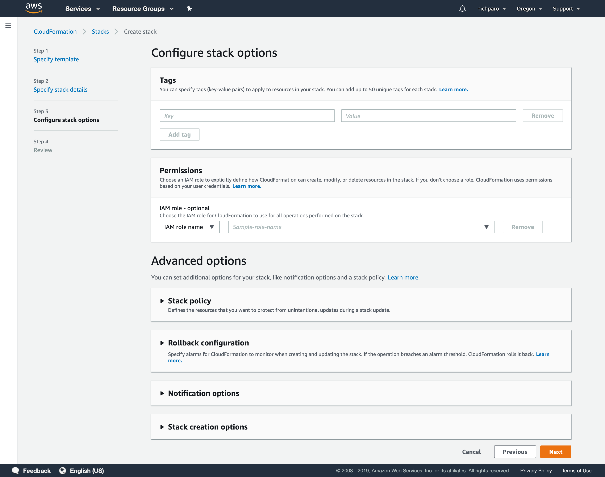
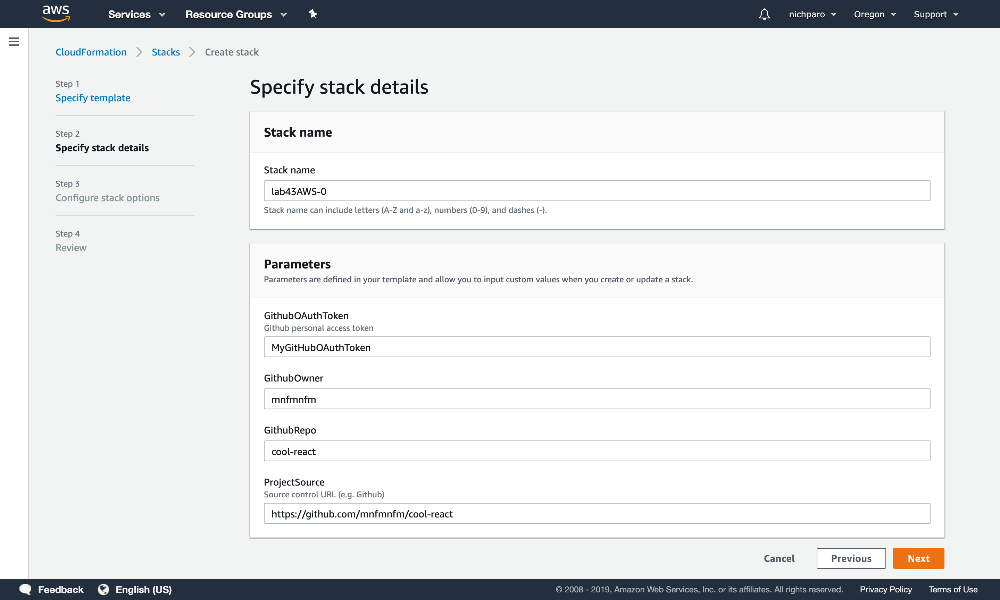
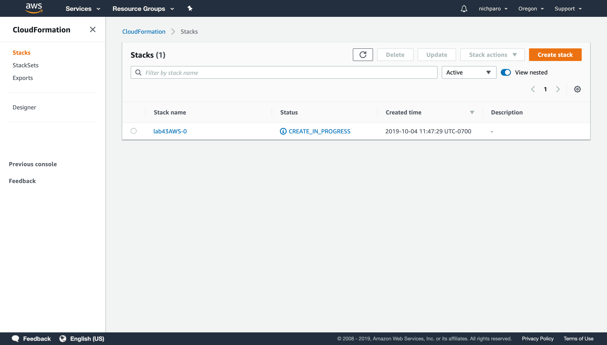
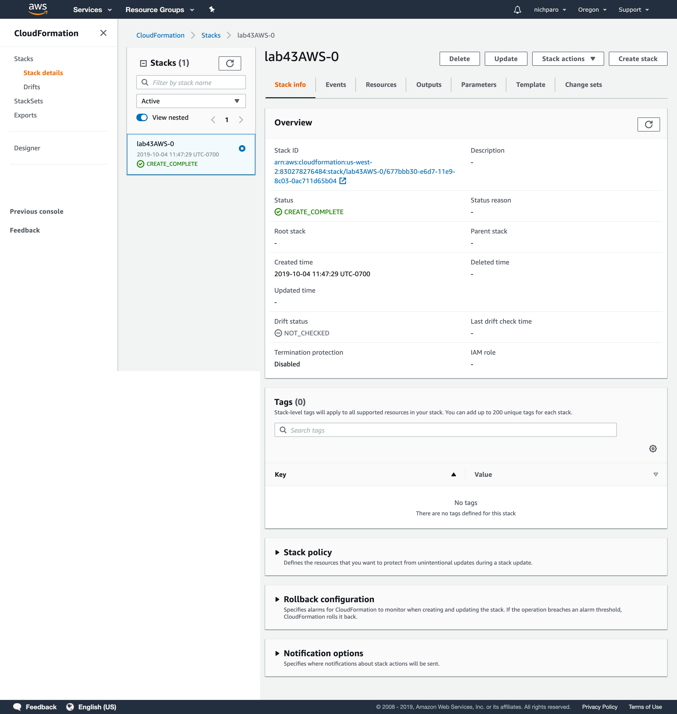

#Cloud Formations

## Lab 43
### Process
* run `npx create-react-app cool-react-app` to initialize a React app.
* upload this to a GitHub repo
* create a GitHub token on your github page
  * click on your user image (top right corner of page)
  * choose `settings`
  * choose `developer settings`
  * choose `personal access tokens`
  * choose `generate new token`
    * give it a name and generate the token
* within the `cool-react-app` directory:
  * run `npm i @code-fellows/aws-tools` to install the aws-tools cdn
  * create a `.env` file and add your routes to the following variables:
  ```
  AWS_GITHUB_URL=
  AWS_GITHUB_REPO=
  AWS_GITHUB_USER=
  AWS_GITHUB_TOKEN=
  AWS_APP=
  AWS_BUILD=
  AWS_BUCKET=
  AWS_PROJECT=
  ```
  * run `aws-react-yaml` to create the yml file
* ACP to github
* go to the AWS console and do perform a cloudFormation - use the images below to as a guideline.

### Images

* Create the stack:
  * choose `Template is ready`
  * choose `Upload a template file`
  * upload the yml file



* Configure the stack:
  * leave all values as default



* Stack Details:
  * add a unique name to the stack



* Stack List:
  * this shows all created stacks



* Stack Overview:
  * provides details about the stack



## Lab 44
### Template 1
* Need to change all instances of the `cool-react-bucket` from kebab-case to camelCase.
