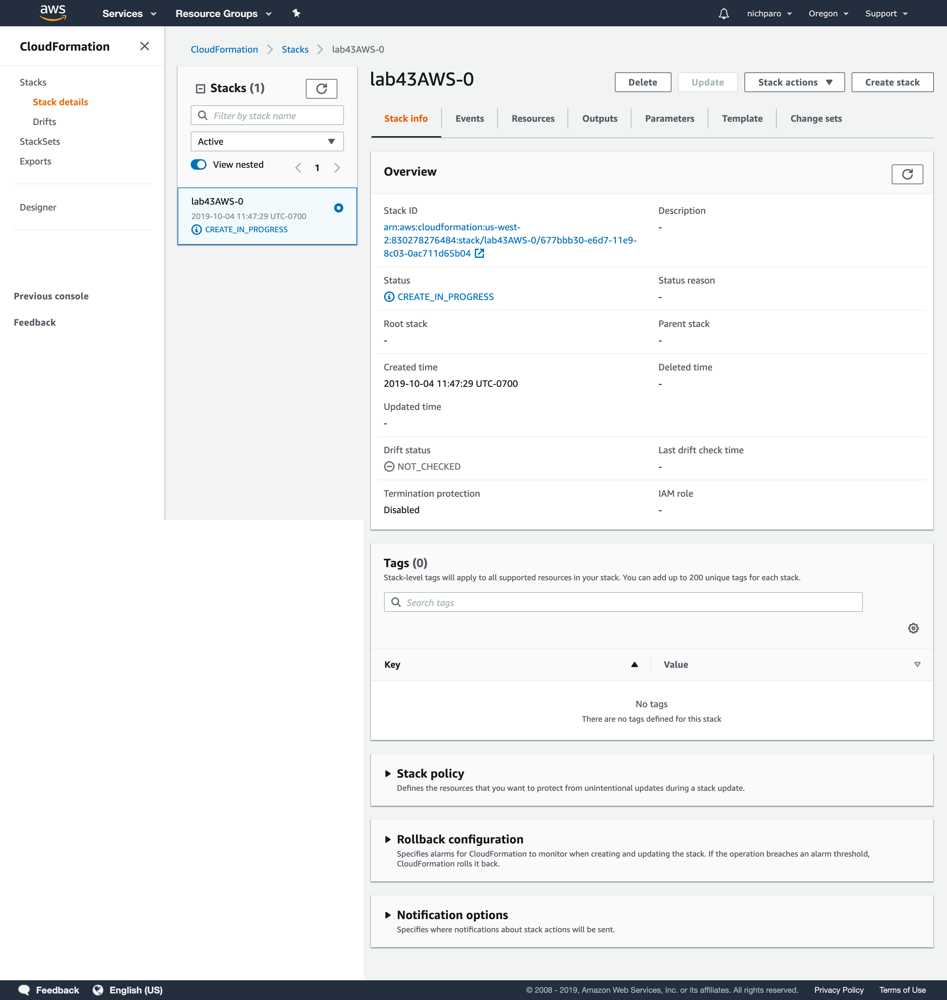

#Cloud Formations

## Lab 43
### Process
* run `npx create-react-app cool-react-app` to initialize a React app.
* upload this to a GitHub repo
* create a GitHub token on your github page
  * click on your user image (top right corner of page)
  * choose `settings`
  * choose `developer settings`
  * choose `personal access tokens`
  * choose `generate new token`
    * give it a name and generate the token

### Images

* Create the stack:
  * choose `Template is ready`
  * choose `Upload a template file`
  * upload the yml file

* Configure the stack:
  * leave all values as default

* Stack Details:
  * add a unique name to the stack

* Stack List:
  * this shows all created stacks

* Stack Overview:
  * provides details about the stack

## Lab 44
### Template 1
* Need to change all instances of the `cool-react-bucket` from kebab-case to camelCase.
